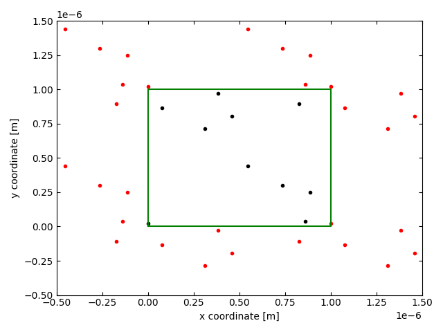
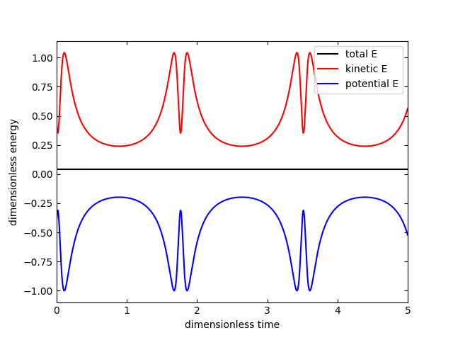
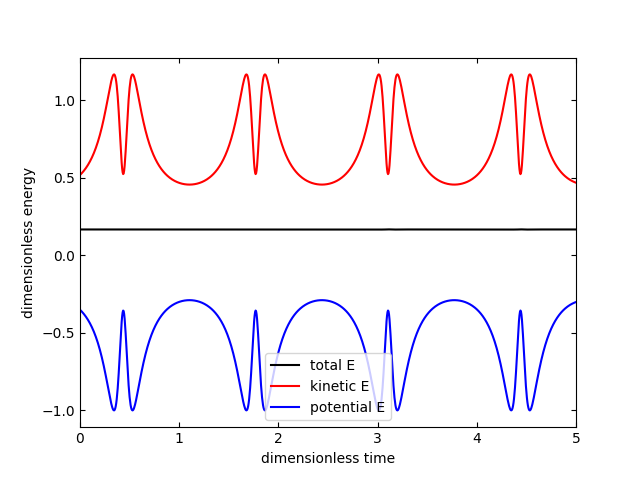
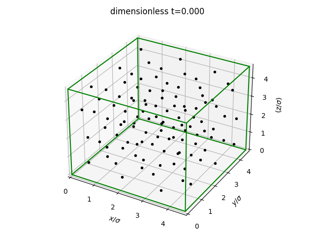
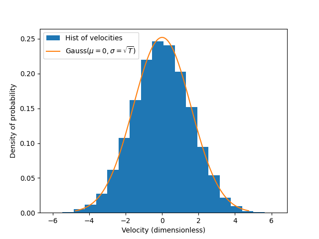

# Weekly progress journal

## Instructions

In this journal you will document your progress of the project, making use of the weekly milestones.

Every week you should 

1. write down **on the day of the lecture** a short plan (bullet list is sufficient) of how you want to 
   reach the weekly milestones. Think about how to distribute work in the group, 
   what pieces of code functionality need to be implemented.
2. write about your progress **until Monday, 23:59** before the next lecture with respect to the milestones.
   Substantiate your progress with links to code, pictures or test results. Reflect on the
   relation to your original plan.

We will give feedback on your progress on Tuesday before the following lecture. Consult the 
[grading scheme](https://computationalphysics.quantumtinkerer.tudelft.nl/proj1-moldyn-grading/) 
for details how the journal enters your grade.

Note that the file format of the journal is *markdown*. This is a flexible and easy method of 
converting text to HTML. 
Documentation of the syntax of markdown can be found 
[here](https://docs.gitlab.com/ee/user/markdown.html#gfm-extends-standard-markdown). 
You will find how to include [links](https://docs.gitlab.com/ee/user/markdown.html#links) and 
[images](https://docs.gitlab.com/ee/user/markdown.html#images) particularly
useful.

## Week 1

### Bullet List

(1) Write `main.py` with some basic working code. This includes:
   - Write the numerical constants for the simulation.
   - Initializing uniformly random velocity and position.
   - Calculate relative position and relative distance matrices for the LJ force.
   - Iterate over time, simulating the velocities and positions using Euler method.
   - Every iteration, check if particles are outside of domain to fulfill periodic boundary conditions (if so, displace them accordingly).
   - Calculate energy to check if it is conserved along time.

(2) Once code works, divide it in function blocks (and use `skeleton.py` as template for the functions)

### Progress

All of the milestones set for this week have been completed. First we wrote all the code in `main.py`. It initialized the particles and run the time evolution of the system [link to particular commit](https://gitlab.kwant-project.org/computational_physics/projects/Project-1_abermejillo_dbedialaunetar_mserraperalta/-/commit/e25d039188a0e8e7fceb45092361b36e0a65c9bd). This completes most of block (1) of the bullet list.

Afterwards,  we optimized the code and changed the relative positions taking into account the periodic boundary conditions [link to particular commit](https://gitlab.kwant-project.org/computational_physics/projects/Project-1_abermejillo_dbedialaunetar_mserraperalta/-/commit/f7deb3540ece2e4ad3cc08ce28c869d4e06e876b).

Then, we added the computation of the total energy of the system [link to particular commit](https://gitlab.kwant-project.org/computational_physics/projects/Project-1_abermejillo_dbedialaunetar_mserraperalta/-/commit/037d679ccd07f29414b13573f86c39a880d6f394). With this we fully completed block (1).

Finally, we structured the code by adding all functionalities into functions in a file called `simulate.py` and added plotting functionalities in a file called `plotting.py`. Now, in `main.py` we only need to specify the simulation parameters and call the appropriate functions. This fulfils (2) in the bullet list.

Some of the results obtained with the actual version of the code are shown hereafter.

1. GIF showing the dynamics of the system:

2. Energy conservation:

We can see how the particles evolve smoothly and interact with eachother (noticeable when they get close to eachother). If we look at the energy we notice an apparently big step that would suggest that the energy is not conserved. However, we can observe that the step is 5 orders lower that that of the actual energy. Nonetheless, when using a higher number of particles ($`N \approx 20`$) there are problems with energy conservation if the box is not very large. We expect those to be solved upon normalization and using the velocity-Verlet algorithm. 

3. Other checks

- Take minimum distance between particles when using periodic BC, see [this gif](results/W1_closest_relative_distance.gif)
- Attractive force when particles are further than $`\sigma`$, see [this gif](results/W1_attractive_force.gif)

In conclusion, all milestones have been more than fulfilled. We have a code that works, it is quite well structured and the few tests that have been done give good results given the stage of the project.  

(due 14 February 2022, 23:59)

## Week 2

### Bullet List

1. Convert to dimensionless units (including deriving the expression of the kinetic energy and changing the scripts) @abermejillo
2. Implement the minimal image convention (done by @mserraperalta in Week 1)
3. Change space dimension from 2D to 3D @dbedialaunetar
4. Update existing plotting functions from 2D to 3D (if necessary) @abermejillo @mserraperalta @dbedialaunetar
5. Write or update the corresponding documentation and `README.md` (from 2D to 3D, units) @abermejillo @mserraperalta @dbedialaunetar
6. Start working with the velocity-Verlet algorithm @abermejillo @mserraperalta @dbedialaunetar
7. Start implementing the initialization of positions onto an fcc lattice and velocities with Maxwell-Boltzmann distribution @abermejillo @mserraperalta @dbedialaunetar

### Progress
Next, we will describe the progress made along the week based on the bullet list above and the commits submitted.

- The minimal image convention was done in Week 1 by @mserraperalta.
- We derived the expression of the kinetic energy in dimensionless units, and then adapted the molecular dynamics simulation to these units (this was done by @abermejillo in [Transform to natural units](b0466ee64fe75954858a147e49161d169a9d36cf)).
- The functions to carry out the simulation of the system were valid also for 3D (this was checked by @dbedialaunetar). The input vector of positions and velocities were changed to be $`N\times 3 `$ matrices, the functions `load_data` and `save_data` and the documentation were adapted to account for arbitrary dimensions (this was done by @mserraperalta in [Update load/save function and documentation for arbitrary dimensionality](a1b15f0a59d773a4bc1b2b85d6196d03a3020759)).
- We wrote functions to save a 3D figure out of every timestep in the simulation, and to create a GIF out of these figures. We then created the GIF for the simulation of two particles near the boundaries (this was done by @abermejillo in [Add 3D plotting](56f6cd4f707702fefe151824180e2f17294fe41d) and in [Change plotting and add results](c440d78073bd902530ca568360f9f85ea4e2e35a)), as asked for in the milestones, and which is discussed below.
- We updated the `README.md` file to account for dimensionless parameters and arbitrary dimensions (this was done by @mserraperalta in [Update README.md for dimensionless parameters and d dimensions](e40c1c927bf4b8c03645223ce6b79d47aa1ad5ef)).
- We implemented the velocity-Verlet algorithm (this was done by @mserraperalta [Add velocity-Verlet algorithm](a828f280fdca68a17a092c51ff95f84f4ccc115b)). We can now simulate our system using both the Euler method and velocity-Verlet algorithm through an argument passed to the function `simulate`.
- We wrote a first version of the function for initializing atoms in an fcc lattice (this was done by @dbedialaunetar in [Create fcc_lattice function](38da9384172583994f0fd535c701af9e8671e9ff)), which was then shortened by @mserraperalta in [Improve fcc lattice function](5adc7fdf7be261142f8e101f45550661bc8c40c0).
- We modified our total energy plotting function so that it also plots the kinetic and potential energies with respect to time (this was done by @mserraperalta in [Add kinetic and potential energy plots](5c485ae416519ef51dcc3517f5433c52ac4d5315)).
- We wrote a script to time every function involved in the simulation, thanks to which we determined a two times speed-up in the calculation of `rel_dist` by using a different numpy function (this was done @mserraperalta in [Add timing calculation for each step of the simulation](b86746f923d0a89d9194d42302f0e740b512e2fd) and in [Optimize rel_dist calculation by 2x](e6246894e87b9f9e6a1d1d0d8f8e1d7265850a14)).
- We wrote a function to plot the relative distance with respect to time, and then obtained one of these plots for two particles, as asked for in the milestones (this was done by @mserraperalta in [Add relative distance plot between 2 particles](27c67dd91be2717924efd072b5484d091ff7bf39) and in [Solve rel_dist error in plotting and add rel_dist results](04db495398d2ef79e3532dd45877986d65b56432)).

**Results and comments**

We now show and discuss the results for the simulation of two particles in 3D.

First, we have a GIF that shows how the two particles move inside a box with periodic boundary conditions.

The particles were initialized close to each other. At times $`t=0.9`$ and $`t=3.8`$ we see how one particle crosses a side of the box and appears on the opposite side, which shows that the periodic boundary conditions work.

We know plot the relative distance between the two particles over time.

At times $`t\approx 1.8`$ and $`t\approx 3.5`$ we see that the relative distance takes a minimum, which represent two scattering events due to the repulsion in the Lennard-Jones potential.

Finally, we plot the total, kinetic and potential energies with respect to time.

The most important conclusion from this graph is that the total energy is, indeed, conserved. We also see that the kinetic and potential energies have opposite extremal points, i.e, when there is a minimum in kinetic energy, there is a maximum in potential energy, and vice versa. Relating the relative distance graph with this one, we see that the wide minima in kinetic energy coincide with the instants where the two particles are furthest apart.

In order to better understand all the peaks that we see in energy, we have created the following GIF that relates each point in time with a point in the Lennard-Jones potential.

All in all, it is clear that we have achieved all milestones and obtained all results from Week 2. Due to the fact that our simulations show repulsion and attraction between particles in addition to scattering events, it seems like the Lennard-Jones potential is being correctly simulated; and since the total energy is conserved, we can infer no mistakes are being made in the coding.

(due 21 February 2022, 23:59)

## Week 3

### Bulletlist

1. Improve the _FCC lattice_ function to omit a 'for' loop and change it so that the whole box is filled @mserraperalta
2. _Energy conservation_ comparison of the Euler and Velociy-Verlet algorithms (plots) @dbedialaunetar
3. Implement _Maxwell velocity distribution_ for the initialization @abermejillo
4. Implement _rescaling_ of the velocities @mserraperalta  
5. Investigate if an _adaptive step verlet algorithm_ can be implemented (and do so if it is) @abermejillo
6. Implement a couple of _observables_ @dbedialaunetar

### Progress 

First, we will briefly comment how the tasks from the bulletlist have been performed and by who. 

1. @mserraperalta improved the [FCC lattice](ba0bff1808cd77a76a5e20e0302df5c13dd83f8a) and changed it's funcitonality so that the box is completely filled .
2. @dbedialaunetar plotted the [comparison of energy conservation](7a260d04f6b65d94c4cce513cd282ae7f5161976) with the two algorithms.
3. @abermejillo implemented the [initialization of the particles velocities](f44ddcde776c63d3378df038a3600f2d4896ae9c) according to a gaussian distribution and analysed it was correct by computing a [density probability function](dbe60d9bb168aa7b3fb4418ac4043e082581a361).
4. @mserraperalta implemented the [rescaling of the velocities](9e211f71a1801dac2880b04aa339a47baf336905) until the system is thermalised to a given temperature
5. @abermejillo investigated on implementing an adaptive step, but this has not given fruitful results so far. We might still look into it during week 4.
6. @dbedialaunetar implemented a function to compute the [specific heat](066122def1e0b341e5458a4177a4dafa287eccc5) and @mserraperalta implemented a function to compute the [pair correlation](7cca72c9242b23417eed285e2a954f5155109d48).

Along the way we did more commits that correspond to solving mistakes and typos as well as including functionalities for plotting and saving data in csv files.

**Results and comments**

All of the milestones have been completed succesfully. Our code already worked for more than 2 particles (Milestone 1). The velocity-Verlet was also already implemented and we had a function to analyse the energy of the system. Comparing the two algorithms we come across the following figure

Euler algorithm             |  Verlet algorithm
:-------------------------:|:-------------------------:
 |  

We can see how for the Euler algorithm energy is not conserved when a particle goes 'inside' other, that is, when the potential increases and the gradient blows off. The velocity-Verlet algorithm, however, manages to keep the total energy of the system constant. We also simulated the trajectories of two particles with both algorithms so that we can see in real space how the two algorithms lead to different time evolutions.

We can see how they start following the same trajectory, but in a very short time they behave completely different.

With this all of the milestones of the week are fulfilled. We have been keeping our code as structured as possible along the whole project; the structure it has now will most probably be kept unchanged. 

Apart from this we show some results regarding milestones of following weeks. We have included the function that provides as an initial position distribution an FCC lattice, which can be seen in the following simulation where we can (more or less) see the FCC structure at a temperature of 119.8 K.

And also included the initialisation for the Maxwell distributed velocities. The following graph shows a density probability function computed from a histogram of the velocities with 20 bins. On top of it there is a gaussian with the same mean (zero) and standard deviation.

Then, we have some results for the two observables we have already implemented. In both cases we still have to analyse whether they match with the experimental results for Argon. For example, in the case of the specific heat we are obtaining a value of 3.11 1/atom, which differs from the 1.5 we should get for an ideal gas. For the case of the pair correlation function we obtain the following results for the following simulation parameters: Nparticles=500, lattice_const=1.54478, box_dimension=7.7239, temperature=0.2, run_time=1, num_tsteps=1000, algorithm_method=verlet.

which has similar peaks to [Wikipedia pair correlation function of Argon](https://upload.wikimedia.org/wikipedia/commons/thumb/b/b8/Simulated_Radial_Distribution_Functions_for_Solid%2C_Liquid%2C_and_Gaseous_Argon.svg/425px-Simulated_Radial_Distribution_Functions_for_Solid%2C_Liquid%2C_and_Gaseous_Argon.svg.png?20151030020319), but the peaks don't exactly match (i.e. the first peak is not at $`r/\sigma=1`$). This will be our main task for the upcoming week.

Finally, some comments on the adaptive step algorithm we wanted to implement. The idea is to be able to, at each step, update the timestep so that it is small when the gradient is big and viceversa. In this way we can optimize the code so that it has high precision, but is quicker thatn just setting the timestep very small. However, we found out that such an algorith for a manybody system like this brings many problems. Due to the amount of particles involved there are always pairs of particles strongly interacting. This leads to, in general, always choosing a very small timestep. 

What we tried was implementing a correction on the timestep following the idea explained in the following paper: [Numerical Solutions of Nonlinear Ordinary Differential Equations
by Using Adaptive Runge-Kutta Method](https://www.researchgate.net/publication/335841661_Numerical_Solutions_of_Nonlinear_Ordinary_Differential_Equations_by_Using_Adaptive_Runge-Kutta_Method). They compare two algorithms to compute the error at each step. In their case it is between fith and forth order runge kutta, for us it is between Euler and velocity-Verlet algorithm. With that we can update the timestep according to the following formula

- if error $`\geq`$ tolerance then $`h_{new}=\delta h (\frac{tolerance}{error})^{0.2}`$ 

- if error $`<`$ tolerance then $`h_{new}=\delta h (\frac{tolerance}{error})^{0.25}`$ 

where $`error=0.5h^2F(x(t))`$, the difference between Euler and Verlet positions. Here we can see that this error is given by a vector, that is, we have an error for each particle. If we decided to take the maximum of this errors as the error, then we always get a super high value (several orders of magnitude greater than the box_size). The aproach taken was then to take the median of this array. following this approach we are able to change the timestep without going to ridiculously small values. 

So far this approach does not give better results than our previous code. We might discuss it in this weeks meeting and decide whether we want to put more effort into investigating different approaches to adaptive step solving of ODEs.

(due 28 February 2022, 23:59)

## Week 4
(due 7 March 2022, 23:59)

## Week 5
(due 14 March 2022, 23:59)
